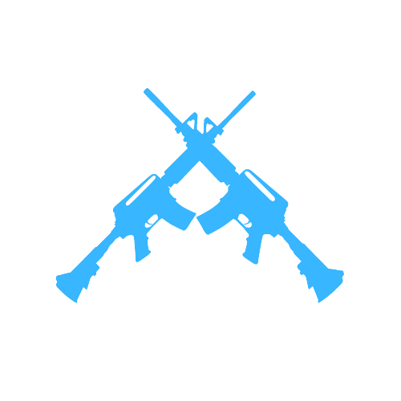
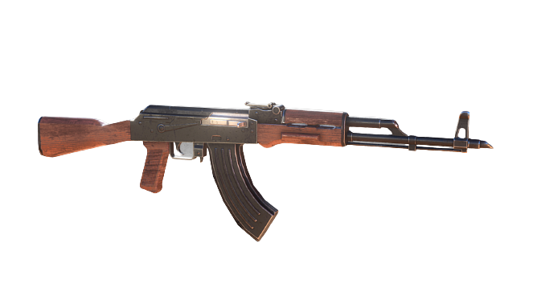
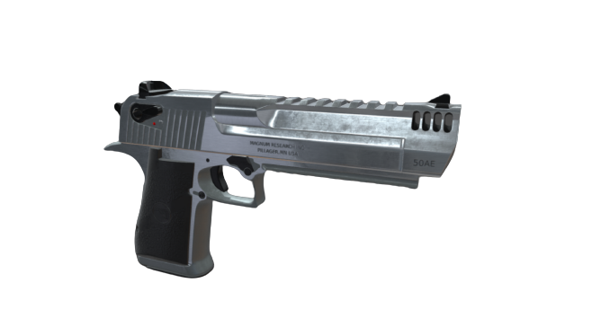
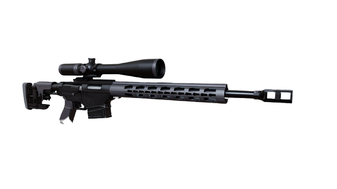
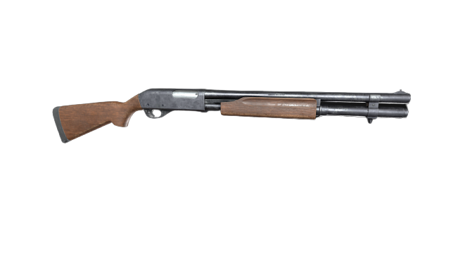
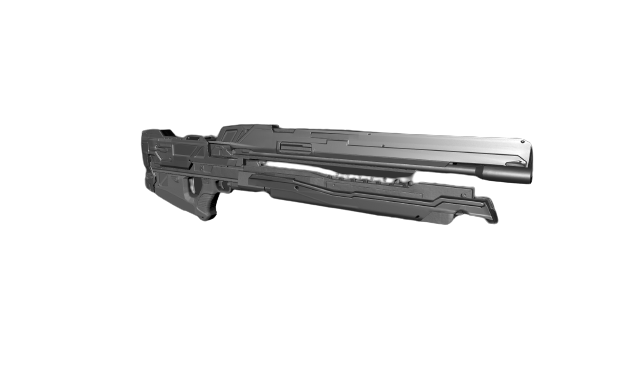
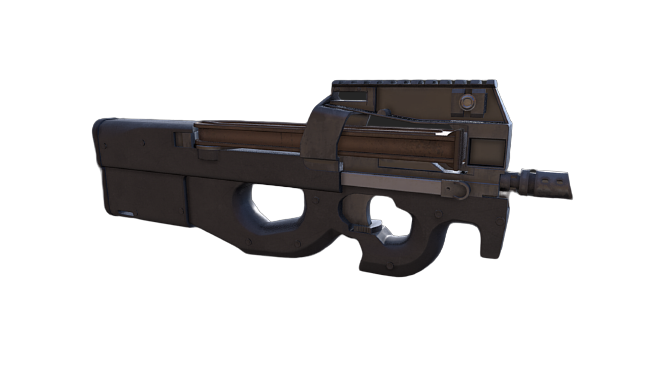
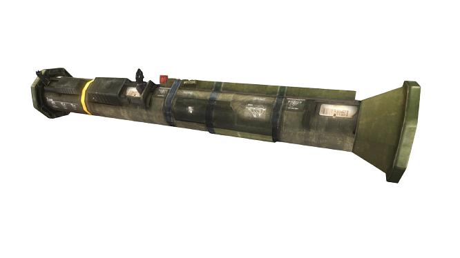
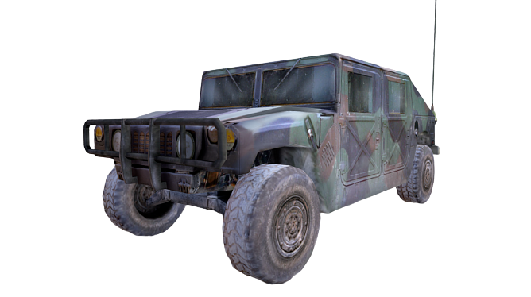
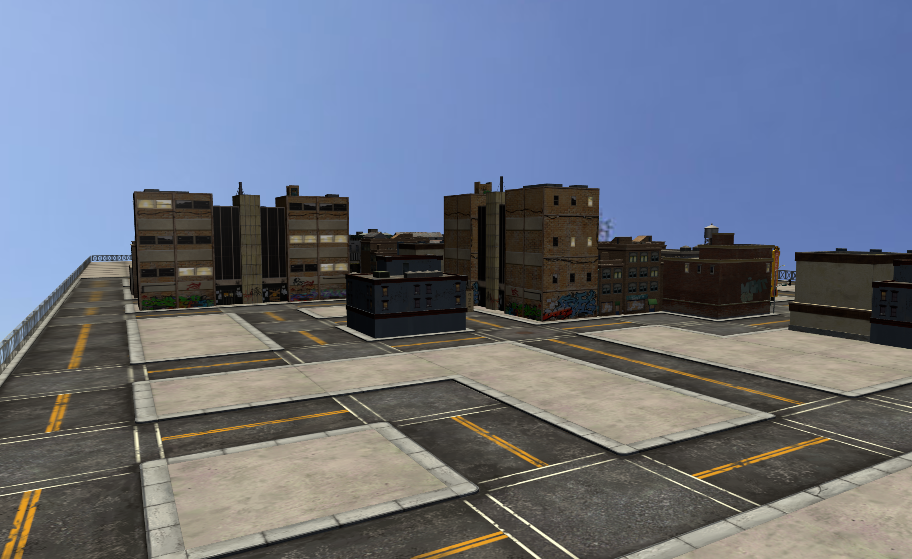

#  F-P-S <small>2</small>
Welcome to FPS2!

__FPS2__ is a __First-Person-Shooter__ like the orginal ([FPS1](https://github.com/Parking-Master/FPS)). It features a wide variety of customization, in-game experience, and more! Read more to see what the game has.
 
 
A big thanks to the 3d modelers for helping create some of the items used in this game. Credits are [below](#credits).

### Ok, it's great. But where do I play it?
The game is fully available for everyone to play. The website is hosted with __GitHub Pages__ at:

<a href="https://fps2.uk.to">f p s 2 . u k . t o </a>

## About
Why is FPS 2 better than the original?
### 1. Performance
The original FPS was a fun game with lots of Features & Misc, but when it comes to performance, it's not very good.

#### FPS 1
- Choppiness: 5/10
- Battery Usage: 9/10
- Data usage: 9/10

#### FPS 2
- Choppiness: 2/10
- Battery Usage: 4/10
- Data usage: 3/10

If you add all of the lists together, times it by 2, then subtract 100 with it, you'll get the total performance:

__FPS 1__ - 100 - 2(5 + 9 + 9) = 54

__FPS 2__ - 100 - 2(2 + 4 + 3) = 82

Lists are below.

_Note:_
 - "positive performance" means _good_ performance that has reduced lag or uses less resources.

 - "negative performance" means _bad_ performance that has uses more battery life, resources, or is choppy/glitchy.
 
#### FPS 1
- Total positive performance: 54/100
- Total negative performance: 46/100

#### FPS 2
- Total positive performance: 82/100
- Total negative performance: 18/100

As you can see in the total negative performance, FPS2 has almost _no negative performance_ compared to FPS1.
### 2. Style

Obviously, new game can't be completely similar style-wise to the original game, so there is a huge difference in Menus, In-game UI design, and _much_ more.

#### FPS 2:

#### FPS 1:

A lot of responsiveness has also been added not only for screen size, but for touch support and element spacing.

### 3. Features & Misc
In _FPS 2_, there are a LOT more features compared to FPS 1. All new/old features are below.

_Note: New features are marked with a "+", and old features are marked with a "-"_

&nbsp;&nbsp;- Preferences 
&nbsp;&nbsp;+ The store 
&nbsp;&nbsp;- Fake currency 
&nbsp;&nbsp;+ New in-game maps 
&nbsp;&nbsp;+ New in-game weapons 
&nbsp;&nbsp;+ Change page theme 
&nbsp;&nbsp;+ Unlock prizes 
&nbsp;&nbsp;+ New help/support menu

### Overall
An overall rating for FPS 1 is: 
50/100

- +20 for Fun and Game Experience
- +15 for Features and Misc
- +10 for Device Support
- +5 Style

The overall rating for FPS 2 is: 
100/100

- +35 for Fun and Game Experience
- +30 Style
- +25 for Features and Misc
- +10 for Device Support

## How to play
All controls are basically the same as the original.

### Key controls
<blockquote>A &nbsp;&nbsp;- Unide gamepad</blockquote>
<blockquote>T &nbsp;&nbsp;- Interact</blockquote>
<blockquote>F &nbsp;&nbsp;- Fire</blockquote>
<blockquote>R &nbsp;&nbsp;- Reload</blockquote>
<blockquote>Space - Jump</blockquote>
<blockquote>M &nbsp;&nbsp;- Throw Grenade</blockquote>
<blockquote>Cursor &nbsp;&nbsp;- Look Around</blockquote>
<blockquote>ᐱ &nbsp;&nbsp;- Walk Forward</blockquote>
<blockquote>ᐯ &nbsp;&nbsp;- Walk Backward</blockquote>
<blockquote>ᐸ &nbsp;&nbsp;- Walk Left</blockquote>
<blockquote>ᐳ &nbsp;&nbsp;- Walk Right</blockquote>

### Gamepad controls
<blockquote>[RT] - Fire</blockquote>
<blockquote>[RB] - Reload</blockquote>
<blockquote>[A] &nbsp;- Jump</blockquote>
<blockquote>[LT] - Throw Grenade</blockquote>
<blockquote>[R] &nbsp;- Look Around</blockquote>
<blockquote>[Lᐱ] - Walk Forward</blockquote>
<blockquote>[Lᐯ] - Walk Backward</blockquote>
<blockquote>[Lᐸ] - Walk Left</blockquote>
<blockquote>[Lᐳ] - Walk Right</blockquote>

### Menu and Options controls
_Note: These are minimized help lists. To view the full ones, go to [fps2.uk.to](https://fps2.uk.to) and click "help"._

#### To play a game
- Go to the main menu.
- Click "PLAY"
- Go to "Quick play" in the drop down
- Enter your search preferences and join.

#### To change your Preferences
- Go to the main menu.
- Click "PLAY"
- Go to "Preferences" in the drop down
- Change to whatever you like.

## Features and Misc Items
### Game items (Weapons, Characters, Maps and Vehicles)
#### Weapons
##### AK-47 Rifle
The AK-47 is the most popular weapon in the game because many choose to keep it as their default rifle.

The AK-47 Rifle variant is also a very reliable weapon with full auto mode and 1/20 damage.

Show details

<ul>
<li>Damage: 5/100</li>
<li>Accuracy: 55/100</li>
<li>Recoil: 20/100</li>
<li>Fire delay: 120 ms</li>
<li>Reload time: 6500 ms</li>
</ul>

##### Desert Eagle
The .50 cal Desert Eagle ("Deagle") is a very high-recoil and causes critical damage with just a single bullet.

It fires .50 Cal pistol rounds.

Show details

<ul>
<li>Damage: 15/100</li>
<li>Accuracy: 30/100</li>
<li>Recoil: 60/100</li>
<li>Fire delay: 250 ms</li>
<li>Reload time: 3000 ms</li>
</ul>

##### Sniper Rifle
The Sniper Rifle or "Marksman Rifle" is a high-damage DMR that works for close-range and mid-range use.

This weapon variant is in between two kinds of weapons: A .50 cal sniper rifle, and a mid-range DMR.

Show details

<ul>
<li>Damage: 40/100</li>
<li>Accuracy: 40/100</li>
<li>Recoil: 30/100</li>
<li>Fire delay: 250 ms</li>
<li>Reload time: 2500 ms</li>
</ul>

##### Remington Shotgun
The Remington 870 Shotgun is a beautiful high-damaging rifle, with all kinds of finishing and a wooden grip.

It fires tiny Birdshot pellets from a 380 shotgun shell, as well as some varieties of Buckshot.

Show details

<ul>
<li>Damage: 40/100</li>
<li>Accuracy: 55/100</li>
<li>Recoil: 35/100</li>
<li>Fire delay: 100 ms</li>
<li>Reload time: 3000 ms</li>
</ul>

##### Railgun
The Railgun is an electric weapon which fires ammunition by charging it through a coil tube.

The Railgun can also inject objects with an explosive, or just use the plain ammuntion.

Show details

<ul>
<li>Damage: 100/100</li>
<li>Accuracy: 35/100</li>
<li>Recoil: 50/100</li>
<li>Fire delay: [N/A] ms</li>
<li>Reload time: 2500 ms</li>
</ul>

##### P90 SMG
The P90 is a full auto SMG/UZI that uses very fast rapid-fire, and causes minimal damage on semi-auto mode.

The P90 is a favored weapon for being __easy to use__, __reliable__, and __fast__.

Show details

<ul>
<li>Damage: 5/100</li>
<li>Accuracy: 40/100</li>
<li>Recoil: 15/100</li>
<li>Fire delay: [N/A] ms</li>
<li>Reload time: 2000 ms</li>
</ul>

##### Grenade Launcher
The M32 Grenade Launcher is a basic cannon that launches frag grenades up to 30m.

This weapon is most commonly used in vehicle-operated warzones on the battlefield.

Show details

<ul>
<li>Damage: [N/A]</li>
<li>Accuracy: 50/100</li>
<li>Recoil: 20/100</li>
<li>Fire delay: [N/A] ms</li>
<li>Reload time: 0 ms</li>
</ul>

##### Rocket Launcher
The Rocket Launcher streams an Air Rocket into the target it's aiming at.

This weapon is most commonly used in vehicle-operated warzones on the battlefield, just like the Grenade Launcher.

Show details

<ul>
<li>Damage: 95/100</li>
<li>Accuracy: 10/100</li>
<li>Recoil: 25/100</li>
<li>Fire delay: [N/A] ms</li>
<li>Reload time: 0 ms</li>
</ul>

##### 9mm Glock
The Glock-17 is a semi-auto pistol, that uses 9mm pistol rounds.

The Glock is available in many situations during the game, which makes it the go-2 pistol/secondary weapon.

Show details

<ul>
<li>Damage: 20/100</li>
<li>Accuracy: 25/100</li>
<li>Recoil: 15/100</li>
<li>Fire delay: 50 ms</li>
<li>Reload time: 1600 ms</li>
</ul>

#### Vehicles
##### Army Humvee
The Humvee Pickup is a reliable vehicle that takes 100+ damage without being destroyed, but watch out for those tight corners!

#### Maps
##### Cargo Port
The __Cargo Port__ map appeared in the original FPS with low-poly textures, blurry lighting and no shadows.

The all-new __Cargo Port__ map features physically correct lighting, realistic shadows, and high-resolution textures, with light emitting from the sun.

<kbd></kbd>

Show old map

<kbd></kbd>

##### Vertex
The map "Vertex" appeared several times in the first prototypes of FPS 1.

This map has been redesigned to perfection in this amazing old-fashioned farm-like styled map.

<kbd></kbd>

##### Ghost City
The Ghost Map also appeared in FPS 1, but not until the very end of the game developement.

The map is not very big in width, but much bigger in length, which makes a good FPS map.

<kbd></kbd>

##### Abandoned City
The Abandoned City is like the ["Ghost" map](#ghost-city), but it's bigger and a little more realistic.

The Abandoned City is futuristic because of it's unique in-game capabilities.

<kbd></kbd>

### In-game photos
<kbd>

## Credits
&nbsp;&nbsp;[Animated AK-47 Arms](https://sketchfab.com/3d-models/ak47-6e51d6ffd33e412a930aff9f520066e1) by [kursat_sokmen](https://sketchfab.com/kursat_sokmen) - Licensed under CC 4.0

&nbsp;&nbsp;[Animated AK-47 Rifle](https://sketchfab.com/3d-models/ak47-831519a097d84e079fd8bc4b15e5b57d) by [wburton95](https://sketchfab.com/wburton95) - Licensed under CC 4.0

&nbsp;&nbsp;[Desert Eagle Pistol](https://sketchfab.com/3d-models/desert-eagle-gun-1605b6c38826433fb3fe564e1d043199) by [attix84work](https://sketchfab.com/attix84work) - Licensed under CC 4.0

&nbsp;&nbsp;[Sniper Rifle](https://sketchfab.com/3d-models/sniper-rifle-gameready-free-e520b234140049e7890db0b6c29d3925) by [pashtetuser](https://sketchfab.com/pashtetuser) - Licensed under CC 4.0

&nbsp;&nbsp;[Remington Shotgun](https://sketchfab.com/3d-models/shotgun-bec49e6f99e347cbb60e6390b2c4202c) by [Jonathan Steylaerts](https://sketchfab.com/JonathanSteylaerts) - Licensed under CC 4.0

&nbsp;&nbsp;[P90 SMG](https://sketchfab.com/3d-models/smg-90-3b5371ff0db24407ab592997e5038ad3) by [TORI106](https://sketchfab.com/TORI106) - Licensed under CC 4.0

&nbsp;&nbsp;[M32 Grenade Launcher](https://sketchfab.com/3d-models/m32-grenade-laucher-f7dea83e9f114de99f2e964572f8d7d7) by [hpedrors](https://sketchfab.com/hpedrors) - Licensed under CC 4.0

&nbsp;&nbsp;[Rocket Launcher](https://sketchfab.com/3d-models/rocket-launcher-32177fca0bf54bf3a844b3ba61845c28) by [Ivan008](https://sketchfab.com/hukan008) - Licensed under CC 4.0

&nbsp;&nbsp;[Humvee Vehicle](https://sketchfab.com/3d-models/low-poly-humvee-vehicle-fac4178dc3db4eb9abf7f45425125e1e) by [Duane's Mind](https://sketchfab.com/duanesmind) - Licensed under CC 4.0

&nbsp;&nbsp;[Weapon Box](https://sketchfab.com/3d-models/weapon-box-f59a809c194b459ca884796618315463) by [dwantin](https://sketchfab.com/dwantin) - Licensed under CC 4.0

&nbsp;&nbsp;[Sky Texture](https://polyhaven.com/a/veld_fire) by [Greg Zaal](https://polyhaven.com/all?a=Greg%20Zaal) - Licensed under CC0

&nbsp;&nbsp;[Steve the soldier](https://www.mixamo.com/#/?page=1&query=Steve&type=Character) by [mixamo.com](https://www.mixamo.com) - _No License_

&nbsp;&nbsp;[Swat guy Max](https://www.mixamo.com/#/?page=1&query=Swat&type=Character) by [mixamo.com](https://www.mixamo.com) - _No License_

&nbsp;&nbsp;__All animations__ by [mixamo.com](https://www.mixamo.com) - _No License_

&nbsp;&nbsp;__Website design__ by [Canva](https://canva.com) - _No License_

## Support & Contribution
If you liked [this project](./) or any other ones, a good way to support us is by starring the repositories you like. 
Another good way to support us is to let us know about bugs, give us ideas for future updates, etc.

Email us at: 
- [__fps5@mail.com__](mailto:fps5@mail.com)

Or: 
- [__parkingmaster@email.com__](mailto:parkingmaster@email.com)

Or you can report bugs and send feature requests in the "Issues" section, [here](https://github.com/Parking-Master/FPS2/issues/new).

## License & Copyright information
&copy; 2021-2023 Parking Master 
License: __MIT__
